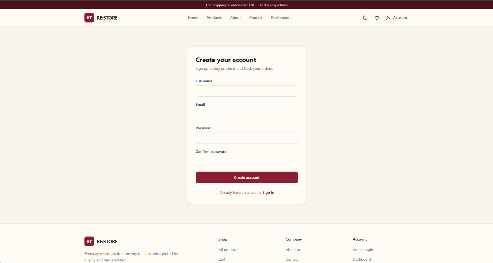
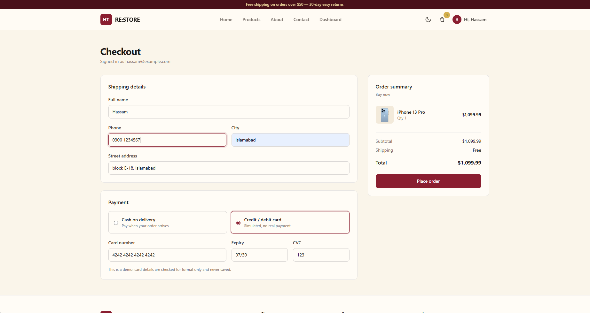
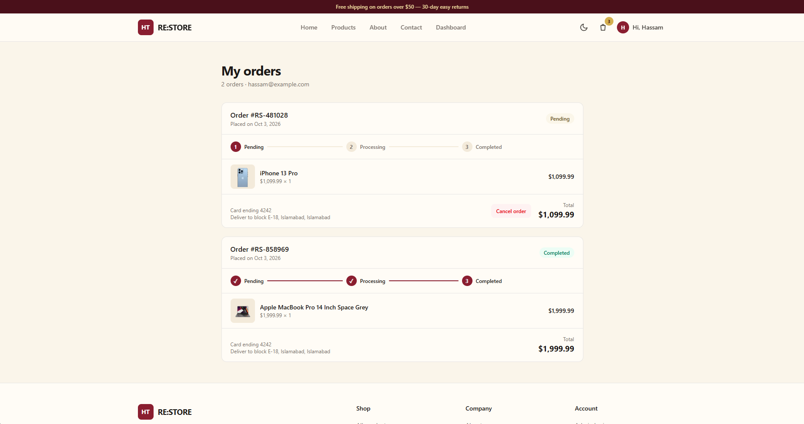
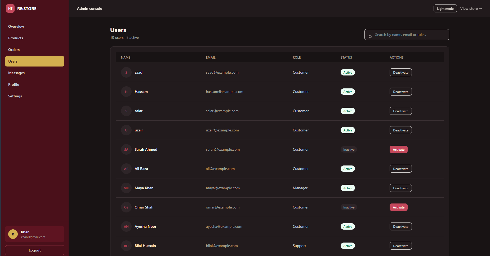
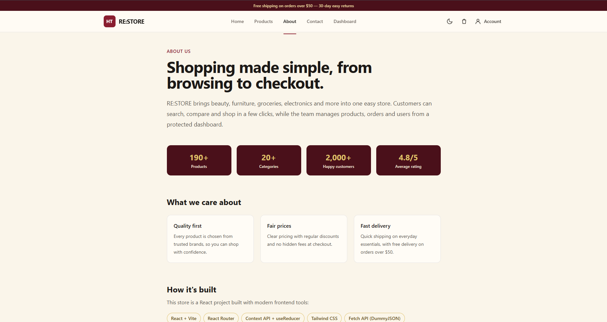
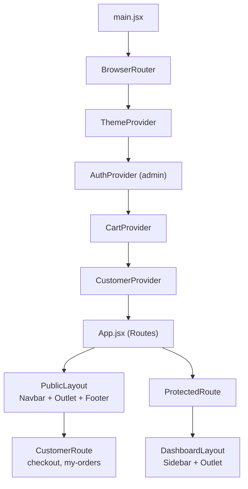
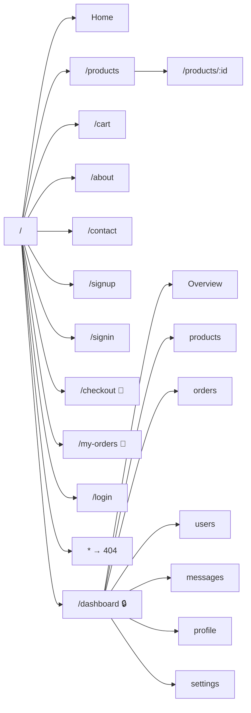
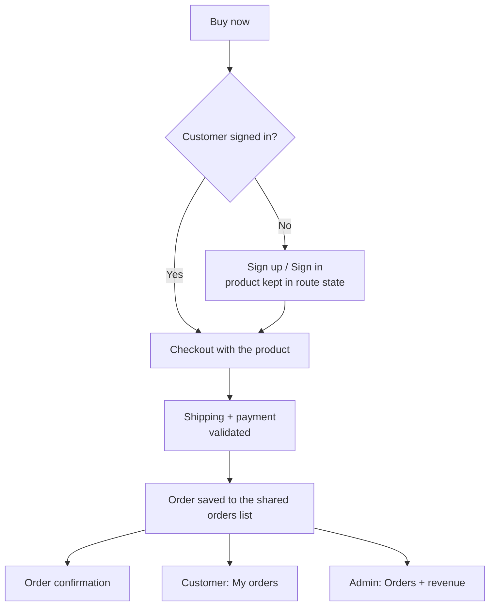
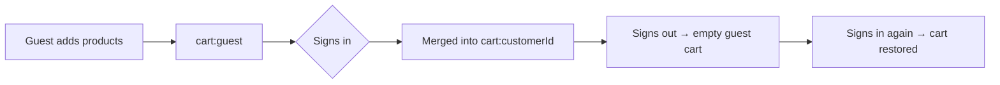
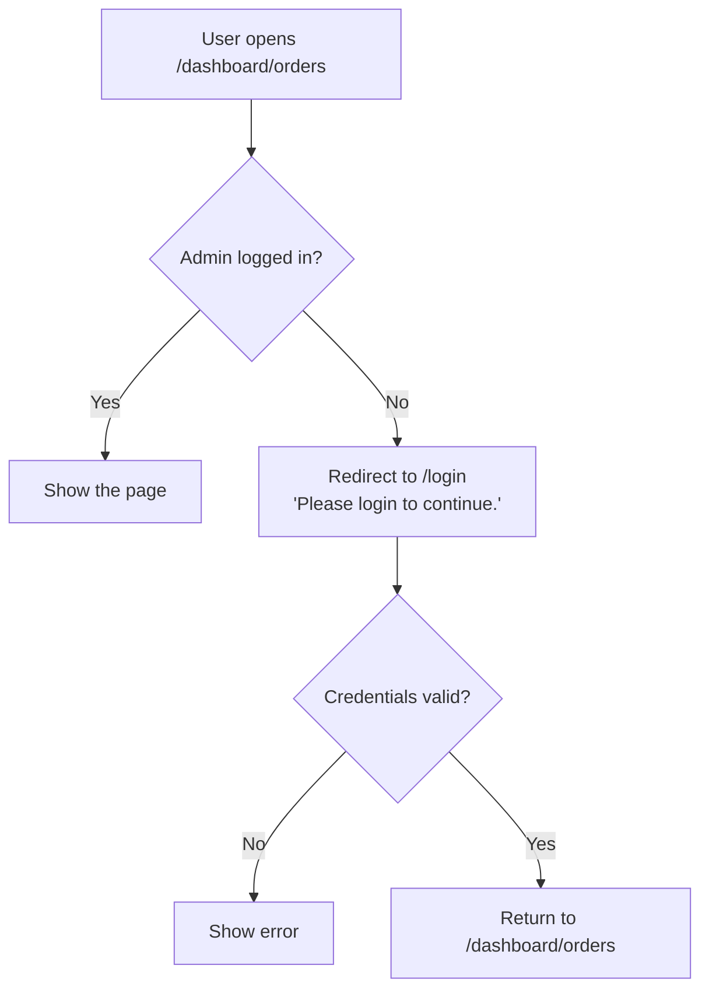

# RE:STORE — React E-Commerce & Admin Management System

A complete e-commerce web application built with **React and Vite**. Customers can browse, search and filter products, create an account, keep their own cart, buy products through a full checkout, and track their orders. Store administrators get a **protected dashboard** to manage products, orders, users and customer messages, edit their profile and change settings, including a **dark/light theme**.

The project was built as the final project of a React internship. It brings together authentication, protected and nested routing, API integration, global state with Context API and `useReducer`, custom hooks, performance optimization, controlled forms, localStorage persistence and a fully responsive UI.


---

## Table of contents

- [Screenshots](#screenshots)
- [Features](#features)
- [Technologies used](#technologies-used)
- [Demo credentials](#demo-credentials)
- [API used](#api-used)
- [Getting started](#getting-started)
- [Project structure](#project-structure)
- [Architecture](#architecture)
- [React concepts used](#react-concepts-used)
- [Data saved in localStorage](#data-saved-in-localstorage)
- [Design system](#design-system)
- [Notes and limitations](#notes-and-limitations)
- [Author](#author)

---

## Screenshots

| Home | Products |
| --- | --- |
|  |  |

| Product details | Shopping cart |
| --- | --- |
|  |  |

| Sign up | Checkout |
| --- | --- |
|  |  |

| My orders | Admin dashboard |
| --- | --- |
|  |  |

| Products management | Dark mode |
| --- | --- |
|  |  |

| About | Mobile view  |
| --- | --- |
|  |  |

---

## Features

### Store

- **Home page** with a hero section, store introduction, top-rated featured products and a call to action
- **Product catalog** loaded from the DummyJSON API (194 products)
- **Search** by product name, description or category, combined with a **category filter**
- **Product details** page on a dynamic route (`/products/:id`) with an image gallery, price, discount, rating, stock, brand, shipping, warranty and return policy
- **Shopping cart**: add, remove, increase and decrease quantity, clear the cart, total items and total price, with a free-shipping hint
- **Contact form** with validation, error messages and a success message; messages are delivered to the admin inbox
- **Dark and light theme**, remembered after a refresh
- **Loading, error and empty states** on every data-driven section, with a "Try again" button for failed requests
- **404 page** for unknown routes

### Customer accounts and checkout

- **Sign up and sign in** with validation; passwords are **hashed with SHA-256** before they are saved
- **Account menu** in the navbar showing the signed-in customer, My orders and Sign out
- **A cart for every customer**: guests can shop without an account; when they sign in, their guest cart is merged into their account cart, which is kept after signing out
- **Buy now** on every product: signed-out customers are sent to sign up and brought back to checkout with the same product
- **Checkout** for a single product or the whole cart, with shipping details, cash on delivery or a simulated card payment, and an order confirmation
- **My orders**: customers see only their own orders, follow the status with a progress tracker, and can cancel orders that are still pending
- **Protected customer routes**: checkout and My orders require a signed-in customer

### Admin area (login required)

- **Authentication** with a demo account; login state survives a refresh
- **Protected routes**: every `/dashboard` page redirects to login when signed out, then returns the admin to the page they wanted
- **Dashboard overview**: total products, orders, users and revenue, recent orders, recent products and quick actions
- **Products management**: product table with search, and **view, add, edit and delete** in a reusable modal (changes are saved in the browser)
- **Orders**: orders table with **status filtering** (Pending, Processing, Completed, Cancelled) and status updates; customer orders appear here automatically
- **Users**: users table with **search** and activate/deactivate; new customers appear here, and deactivating a customer signs them out
- **Messages**: inbox for contact form messages with read/unread status, an unread filter, a detail view, reply by email and delete
- **Profile**: editable controlled form with validation; the new name appears instantly across the app
- **Settings**: dark mode switch, notifications, language, currency and account preferences
- **Responsive sidebar** that becomes a slide-in menu on mobile

---

## Technologies used

| Technology | Purpose |
| --- | --- |
| [React](https://react.dev/) | UI library (functional components and hooks) |
| [Vite](https://vite.dev/) | Development server and build tool |
| [React Router](https://reactrouter.com/) | Client-side routing: nested, dynamic and protected routes |
| [Tailwind CSS](https://tailwindcss.com/) | Utility-first styling with a custom color theme |
| Context API + `useReducer` | Global state for admin auth, customers, cart and theme |
| Fetch API | Loading data from the REST API (no Axios) |
| Web Crypto API | Hashing customer passwords (SHA-256) |
| localStorage | Persisting accounts, carts, orders, theme and admin data |
| ESLint | Code quality checks |

No Redux, Axios or UI component libraries (Material UI, Bootstrap, Ant Design) are used.

---

## Demo credentials

**Admin dashboard** (`/login`):

| Email | Password |
| --- | --- |
| `khan@store.com` | `khan8` |

**Customer accounts:** create one on the **Sign up** page (`/signup`), or click **Buy now** on any product while signed out.

---

## API used

Product data comes from the free [DummyJSON Products API](https://dummyjson.com/docs/products).

| Endpoint | Used for |
| --- | --- |
| `https://dummyjson.com/products?limit=0` | All products (Products page) |
| `https://dummyjson.com/products/:id` | One product (Product details page) |
| `https://dummyjson.com/products?limit=4&sortBy=rating&order=desc` | Top-rated featured products (Home) |
| `https://dummyjson.com/products?limit=5&sortBy=id&order=desc` | Recent products (Dashboard) |

DummyJSON doesn't save changes, so accounts, carts, orders, product management, users and messages are stored in the browser with localStorage.

---

## Getting started

### Prerequisites

- [Node.js](https://nodejs.org/) 18 or newer
- npm (included with Node.js)

### Installation

```bash
# 1. Clone the repository
git clone https://github.com/HassamKhan0826/React-E-Commerce-Admin-Management-System.git

# 2. Go into the project folder
cd React-E-Commerce-Admin-Management-System/react-ecommerce

# 3. Install dependencies
npm install

# 4. Start the development server
npm run dev
```

Then open the URL shown in the terminal (usually `http://localhost:5173`).

Password hashing uses the browser's Web Crypto API, which only works on secure addresses: `localhost` and `https`.

### Available scripts

| Command | Description |
| --- | --- |
| `npm run dev` | Start the development server |
| `npm run build` | Create a production build in `dist/` |
| `npm run preview` | Preview the production build locally |
| `npm run lint` | Check the code with ESLint |

---

## Project structure

```
react-ecommerce/
├── index.html
├── package.json
├── vite.config.js
└── src/
    ├── main.jsx                  # App entry: router and context providers
    ├── App.jsx                   # All routes
    ├── index.css                 # Tailwind, theme colors and dark mode
    │
    ├── components/
    │   ├── Button.jsx            # Reusable button (variants and sizes)
    │   ├── Card.jsx              # Reusable card container (children)
    │   ├── CartItem.jsx          # One cart row (React.memo)
    │   ├── CategoryFilter.jsx    # Category dropdown
    │   ├── Container.jsx         # Page width and spacing wrapper
    │   ├── CustomerRoute.jsx     # Protects customer pages (checkout, my orders)
    │   ├── DashboardLayout.jsx   # Admin layout: sidebar + header + Outlet
    │   ├── EmptyState.jsx        # "Nothing here" message
    │   ├── ErrorMessage.jsx      # Error box with "Try again"
    │   ├── Footer.jsx
    │   ├── Loading.jsx           # Loading spinner
    │   ├── Modal.jsx             # Reusable popup (children)
    │   ├── Navbar.jsx            # Store navbar, cart count, theme toggle, account menu
    │   ├── ProductCard.jsx       # One product with Add to cart and Buy now (React.memo)
    │   ├── ProductList.jsx       # Product grid
    │   ├── ProtectedRoute.jsx    # Protects admin pages
    │   ├── PublicLayout.jsx      # Store layout: navbar + Outlet + footer
    │   ├── SearchBar.jsx         # Reusable search input
    │   ├── Sidebar.jsx           # Admin navigation (mobile drawer)
    │   └── UserRow.jsx           # One user row (React.memo)
    │
    ├── context/
    │   ├── contexts.js           # AuthContext, CartContext, ThemeContext, CustomerContext
    │   ├── AuthContext.jsx       # Admin login, logout, profile
    │   ├── CartContext.jsx       # Cart with useReducer, one cart per customer
    │   ├── CustomerContext.jsx   # Customer sign up, sign in, sign out
    │   └── ThemeContext.jsx      # Dark / light theme
    │
    ├── hooks/
    │   ├── useBuyNow.js          # Buy now: checkout or sign up first
    │   ├── useCart.js            # Read the cart context
    │   ├── useCustomer.js        # Read the customer context
    │   ├── useFetch.js           # Fetch data with loading/error states
    │   └── useLocalStorage.js    # useState that is saved to localStorage
    │
    ├── pages/
    │   ├── Home.jsx
    │   ├── Products.jsx
    │   ├── ProductDetails.jsx
    │   ├── Cart.jsx
    │   ├── Checkout.jsx          # Shipping, payment, order confirmation
    │   ├── MyOrders.jsx          # Customer's orders with status tracker
    │   ├── SignUp.jsx
    │   ├── SignIn.jsx
    │   ├── About.jsx
    │   ├── Contact.jsx
    │   ├── Login.jsx             # Admin login
    │   ├── NotFound.jsx
    │   └── dashboard/
    │       ├── Dashboard.jsx
    │       ├── ProductsManagement.jsx
    │       ├── Orders.jsx
    │       ├── Users.jsx
    │       ├── Messages.jsx
    │       ├── Profile.jsx
    │       └── Settings.jsx
    │
    ├── reducers/
    │   └── cartReducer.js        # All cart actions
    │
    └── utils/
        ├── helpers.js            # Formatting, password hashing and shared helpers
        └── mockData.js           # Starting orders and users
```

---

## Architecture

### How the app is put together

Context providers wrap the whole app, so any component can read the theme, admin login, cart and customer without prop drilling. `CartProvider` sits above `CustomerProvider`, because signing in and out switches which customer's cart is shown.



### Routes



👤 = signed-in customer required · 🔒 = admin login required

### Buy now and checkout



### One cart per customer



### Admin login and protected routes



### State management

| Data | Managed with | Why |
| --- | --- | --- |
| Form inputs, search text, filters, menus | `useState` | Local to one component |
| Admin login | `AuthContext` | Needed by Navbar, Sidebar, Login, ProtectedRoute, Profile |
| Signed-in customer | `CustomerContext` | Needed by Navbar, checkout, My orders, Buy now |
| Cart | `CartContext` + `useReducer` | Shared across pages, with related actions, one cart per customer |
| Theme | `ThemeContext` | Affects the whole app |
| Accounts, orders, products, users, messages, settings | `useLocalStorage` | Saved in the browser (no backend) |

---

## React concepts used

| Concept | Where it is used |
| --- | --- |
| `useState` | Forms, search, filters, mobile menu, account menu, modals |
| `useEffect` | Fetching data, saving to localStorage, focusing inputs, theme class, timers, event listeners |
| `useRef` | Auto-focus on forms and search; closing the account menu on an outside click |
| `useContext` | Reading admin auth, customer, cart and theme state |
| `useReducer` | Cart state with `ADD_TO_CART`, `REMOVE_FROM_CART`, `INCREASE_QUANTITY`, `DECREASE_QUANTITY`, `CLEAR_CART`, `LOAD_CART` |
| `useMemo` | Filtered products, cart and checkout totals, revenue, status counts, customer orders |
| `useCallback` | Cart actions, `buyNow`, sign in/out functions, `deleteProduct`, `toggleStatus` passed to memoized children |
| `React.memo` | `ProductCard`, `CartItem`, `UserRow`, `ProductRow` |
| Custom hooks | `useFetch`, `useLocalStorage`, `useCart`, `useCustomer`, `useBuyNow` |
| `children` and composition | `Card`, `Modal`, `Button`, `Container`, `EmptyState` |
| React Router | `BrowserRouter`, `Routes`, `Route`, `Link`, `NavLink`, `Outlet`, `Navigate`, `useNavigate`, `useParams`, `useLocation` |
| Routing patterns | Nested routes, dynamic route, admin and customer protected routes, route state, 404 route |

`React.memo` and `useCallback` work together: functions passed to list items keep the same reference between renders, so product cards and table rows only re-render when their own data changes.

---

## Data saved in localStorage

| Key | Contents |
| --- | --- |
| `isAuthenticated` | Whether the admin is logged in |
| `storeUser` | Admin name, email and role |
| `customers` | Customer accounts (passwords stored as SHA-256 hashes) |
| `currentCustomer` | The signed-in customer (no password) |
| `cart:guest` | Cart of a shopper who isn't signed in |
| `cart:<customerId>` | Each customer's own cart |
| `orders` | All orders: demo orders and orders placed through checkout |
| `users` | Users and their active/inactive status, including new customers |
| `theme` | `"light"` or `"dark"` |
| `managedProducts` | Products after admin changes (empty until the first change) |
| `messages` | Messages sent from the Contact page |
| `preferences` | Admin settings |

To reset the app to its starting data, clear the site's localStorage in the browser's developer tools.

---

## Design system

Colors are defined once as Tailwind theme tokens in `src/index.css`, so the whole palette can be changed in one place.

| Token | Color | Used for |
| --- | --- | --- |
| `brand` | Burgundy | Buttons, links, active states, sidebar |
| `cream` | Beige | Page backgrounds and cards |
| `gold` | Light gold | Ratings, badges, highlights |
| `stone` | Warm gray | Text and borders |

**Dark mode** works by giving the same tokens darker values when `<html>` has the `dark` class, so every component switches theme without separate dark styles.

---

## Notes and limitations

- **Frontend only:** there is no backend. Accounts, carts and orders are saved in the browser, so they exist only on that device and browser.
- **Passwords:** customer passwords are hashed with SHA-256 before saving, but this is not real security, because everything runs in the browser. A real store would verify passwords on a server.
- **Payments are simulated:** card details are checked for format only and never saved; orders store only the last four digits.
- **Admin login** uses a single demo account.
- **Simulated product management:** DummyJSON does not store changes, so admin edits are kept in localStorage, and products added by the admin don't appear in the store. "Reset" restores the API data.
- **Stock** doesn't decrease after a purchase, because product data comes from the API.
- **Reply by email** opens the computer's default email app with a `mailto:` link.
- **Settings:** dark mode is fully connected. The other preferences are saved but not yet applied across the app.

---


## Author

**Hassam Khan** — React.js Developer
Final project for the React.js internship at **Enigma Software Solutions**

GitHub: [@HassamKhan0826](https://github.com/HassamKhan0826)

## Acknowledgements

Thanks to **Enigma Software Solutions** for the internship opportunity, and to **Sohaib Saleem**, Full stack Developer, Next.js, for guidance and code reviews throughout the project.

